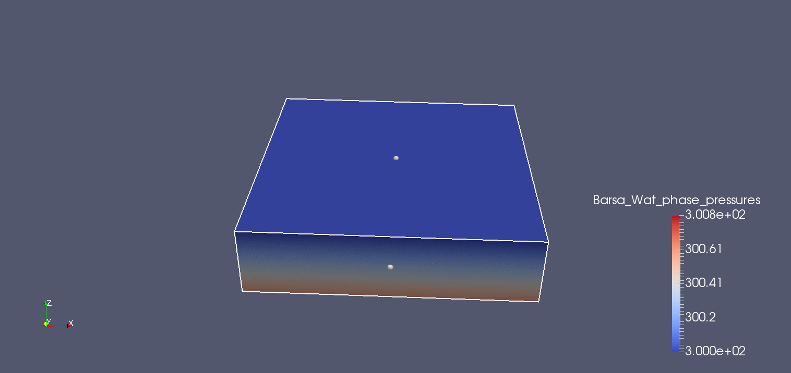

#Vision for Eclipse/Petrel Simulation
* Create VTK structured grid objects for more customizable visualizations than out of the box Eclipse
* Full program package to write VTK objects or import EclipseReader and PRTController objects to parse file into visual file format of your choice
* Easy to follow interface included for running in Python or use Py2exe setup.py file included for Windows executable creation.


Animation of CO2 gas saturation over 280 days (created in Paraview 3.14)



## Running Through Python Interpreter
1. Requires [TQDM](https://github.com/noamraph/tqdm), VTK Python 6.x or higher, and Numpy
2. Navigate to directory where Eclipse Vision source code is located and run```python main.py``` in terminal
3. Eclipse project directory must contain \*.DATA file with specifications of Eclipse simulation and a \*.PRT file that contains simulation outputs
4. Will create directory in Eclipse project directory with VTK files ready for viewing

## Creating Windows EXE file
1. Install all required packages (including py2exe) and navigate to project directory
2. Run ```python setup.py py2exe``` Documentation for Py2Exe is [here](http://www.py2exe.org/index.cgi/Tutorial) for more help.
